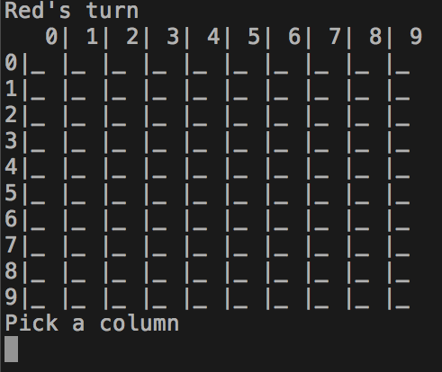

# n x n Connect k

### Connect Four
- Handles an n x n grid and arbitrary length connections lengths
- Game logic could easily be ported to n x n TicTacToe
- To Play: Clone the repo and run `$ ruby lib/game.rb`
